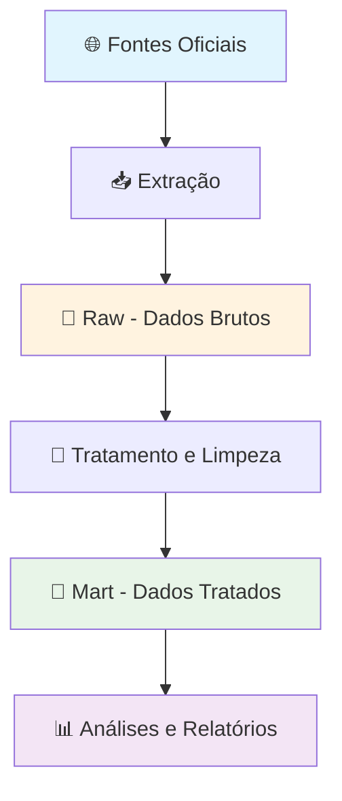

# 📊 Dados dos Municípios - Anuário Socioeconômico de Sergipe

Esta pasta contém informações socioeconômicas dos municípios sergipanos, organizadas em duas camadas principais que facilitam o acesso e uso dos dados.

## 🗂️ Estrutura de Dados

### 📁 **Raw** (Dados Brutos)
Esta camada contém os dados **originais**, exatamente como foram coletados das fontes oficiais. É como um "arquivo morto" onde guardamos as informações no formato mais próximo possível da fonte original.

**Características:**
- ✅ Dados não modificados das fontes oficiais
- ✅ Mantém a estrutura original dos órgãos produtores
- ✅ Serve como backup e referência
- ⚠️ Pode conter inconsistências ou formatos complexos

### 📁 **Mart** (Dados Tratados)
Esta camada contém os dados **limpos e organizados**, prontos para uso em análises, relatórios e visualizações. É como uma "biblioteca organizada" onde tudo está arrumado e fácil de encontrar.

**Características:**
- ✅ Dados padronizados e organizados
- ✅ Estrutura consistente entre diferentes temas
- ✅ Fácil de usar para análises e relatórios
- ✅ Informações complementares calculadas

---

## 📋 Catálogo de Dados Disponíveis

### 💼 **Emprego e Trabalho**
- **CAGED** - Cadastro Geral de Empregados e Desempregados
  - Admissões, desligamentos e estoque de empregos formais

### 🌾 **Agropecuária**
- **Pesquisa Pecuária Municipal (PPM)**
  - Rebanhos, produção animal, aquicultura e vacas ordenhadas
- **Produção Agrícola Municipal (PAM)**
  - Culturas permanentes e temporárias
- **Produção da Extração Vegetal e Silvicultura (PEVS)**
  - Extração vegetal, silvicultura e áreas de produção

### 🚗 **Transportes**
- **Frota de Veículos**
  - Quantidade e tipos de veículos por município

### 💰 **Programas Sociais**
- **Bolsa Família**
  - Beneficiários, valores e cobertura

### 🏪 **Economia**
- **Comércio Exterior**
  - Exportações e importações municipais

### 📈 **Indicadores Econômicos**
- **IPCA** - Índice de Preços ao Consumidor Amplo

### 👥 **Demografia**
- **Censo Demográfico**
  - População e características demográficas

---

## 🔄 Fluxo de Processamento dos Dados

---

## 🔍 Como Usar os Dados

### Para **Usuários Gerais**
- Use sempre os dados da pasta **Mart** para suas análises
- Os arquivos estão em formato Parquet (abrem no Excel, Python, R, Power BI)
- Cada arquivo representa um tema específico

### Para **Desenvolvedores**
- Dados Raw: para entender a estrutura original
- Dados Mart: para análises e aplicações
- Scripts de processamento disponíveis na pasta `Scripts/Municipios/`

---

*Anuário Socioeconômico de Sergipe - Desenvolvido para democratizar o acesso a informações municipais*